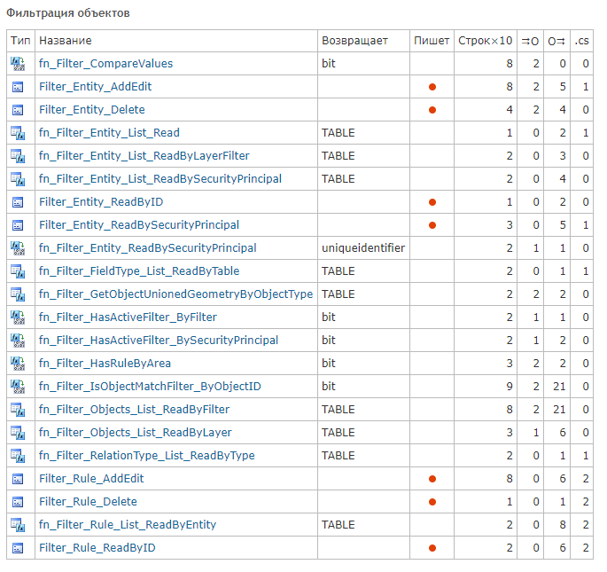
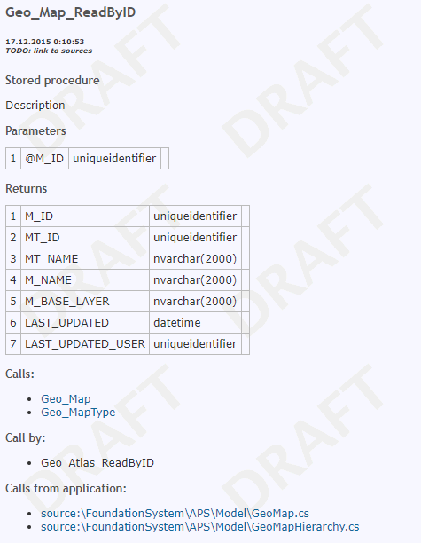
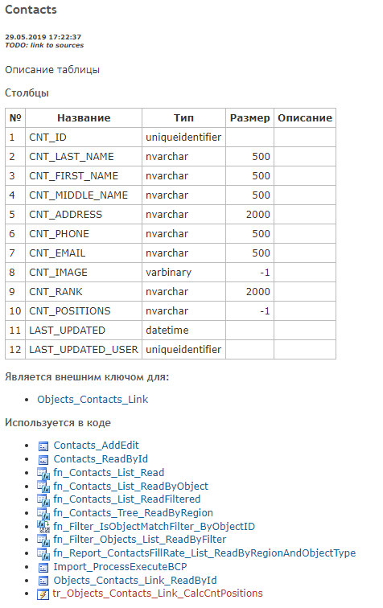

# DbRedmineDoc
Tool for automate documentation MS SQL DB objects to Redmine Wiki.

## Requires:
0. dotnet core 3.1
1. Redmine patch #14829 for setting parent page via REST API (https://www.redmine.org/issues/14829)
2. Textile macro for semantic markup (wiki_formatting/macros.rb):
```ruby      
      desc "Returns text as is. Using only for text semantic markup"
      macro :desc do |obj, args, text|
	    (args.empty? ? "" : args.join(', ')) + " " + (text.present? ? text : "")
```

## Sample wiki pages

### List of routines


### Routine description


### Table description

